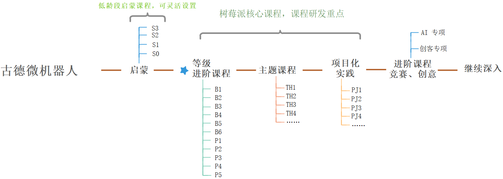

# 概述

## 课程简介

以国务院《新一代人工智能发展规划》、浙江省教育厅《浙江省教育信息化三年行动计划》等文件精神为指导思想，面向未来发展 AI 教育，促进全面发展，打下人工智能时代必备知识和技能的基础。

人工智能小创客系列课程，基于性能和扩展性极佳的树莓派，从入门的直观体验到编程理论知识，结合各类传感器等机械电子器件的灵活运用，并以实物作品的形式展现。通过虚拟和现实的结合激发孩子们的探索创新能力，通过分析、比较、设计与实现的螺旋迭代解决学习生活中的实际问题，不断锻炼和提升逻辑思维能力、自信心和成就感。

通过理论结合实践的方式学习编程和人工智能是最高效的学习方式，本课程首先把基本编程逻辑（顺序结构、循环结构、分支结构）直观的组合调用各个功能，编程就像把遥控器按钮组合排序运行一样简单。
通过图形编程平台提供的工具赋予能力，感受编程的魅力，在体验和玩了中完成编程基础知识的入门学习，在此基础上通过项目化学习的综合运用进一步得以深入学习。

## 编写说明

本书基于已有和正在编写的课件，重新构建完整课程体系。设计目标为古德微课程体系标准。

教案编写原则：

- 课程设置循序渐进，符合学习规律
- 教案讲义编写做到新老师拿到讲义即可进行教学，所有相关内容和知识均在教案中体现或给出准确参考资料。
- 教案的详细编写要求见下文说明

目前的课程以树莓派积木式编程为核心。下降至 Scratch（小学低年级），上升至 Python（中学）

## 课程阶梯结构

## 阶梯范围

### Scratch

级别 ID 为：S0, S1 ... Sn
课件 ID 为：SC01, SC02, ... SCnn

- S0: 体验课
- S1: SC01~SC12
- S2: SC13~SC24
- S3: SC25~SC36

### Raspberry Blockly

级别 ID 为：B0, B1, ... Bn
课程 ID 为：RB01, RB02, ... RBnn

B1, B2 大致相当于原初级 1，初级 2
B3, B4 大致相当于原中级 1，中级 2
B5, B6 预计大部分不会真正开设，B4 之后可直接进入 Python 学习

- B0: 体验课
- B1: RB01~RB15
- B2: RB16~RB30
- B3: RB31~RB45
- B4: RB46~RB60
- B5: RB61~RB75
- B6: RB76~RB90

各阶段教学内容及目标如下（待调整完善）：

#### 入门/初级（B1，B2）

面向初次接触编程、人工智能的学生。以认知和体验为教学目标。激发对人工智能、编程、机器人的兴趣并促进对学科类知识的学习。

1. AI初体验，通过树莓派人工智能创客编程案例感知和体验人工智能的应用；了解机器人、人工智能、3D设计、编程、创客的概念和相互的关系；
2. 通过图形化编程的逻辑指令模块，认识基本的编程逻辑，如顺序、条件、循环三种基本程序结构，问题分解，函数封装的意义等逻辑及应用，培养逻辑思考能力；
3. 了解运算和变量，通过图形化编程中的运算和变量模块，学习基础数学运算及逻辑运算，以及变量的含义。
4. 理解基本输入输出，人工智能和机器人的核心工作流程：信号检测（输入）→逻辑判断（处理）→决策和行动（输出）；
5. 通过编程中涉及的运算，理解数学知识在实际问题中的意义，学习和巩固数学运算能力；
6. 通过解决实际问题，培养逻辑思考和动手能力；
7. 通过课堂协作，培养团队精神、协作和表达能力。

#### 中级（B3，B4）

1.	传感器应用， 通过图形化编程从不同的传感器获得数据，运用顺序、条件、循环等基本逻辑模块完成虚实结合的编程交互体验。达到理解和运用编程的能力。
1.	培养变量和函数的运用习惯，通过生活中的案例情景对照，培养使用变量的意识，会把某些简单的功能封装成函数。
1.	提高归纳和功能分解能力，通过图形化编程中的函数模块对复杂功能归纳和分解，学习系统的分解和组装功能的编程能力。
1.	物联网和人工智能应用，通过图形化编程中的物联网和人工智能模块（文字识别/图形识别等）学习人工智能功能的应用，运用物联网和人工智能功能开发能解决学习和生活实际问题的作品。

#### 高级（B5，B6）

1. 项目化实践，通过经历项目的全过程，在玩中学、学中玩。让学生主动学习，将所学、所思、所想，转换成实物作品，感受造物的快乐。
1. 机器学习，通过人工智能开放平台，体验分类和物体识别功能的训练，利用图形化编程体验分类和物体识别等人工智能功能的应用。
1. 创意指导，了解什么是创意，培养从生活和学习中挖掘创意的习惯。从问题出发，大处思考、小处着手，提出需求和愿望，制定方案。
1. 创造和发明，运用信息技术和开源软硬件，在发现问题、制定方案的基础上完成作品的创造发明。

### Raspberry Python

级别 ID 为：P0, P1, ... Pn
课程 ID 为：RP01, RP02, ... RPnn

- P0: 体验课
- P1: RP01~RP15
- P2: RP16~RP30
- P3: RP31~RP45
- P4: RP46~RP60
- P5: RP61~RP75
- P6: RP76~RP90

### 主题课程（theme）

类别 ID 为： TH1, ... THn
课程 ID 为：TH101, TH102, ... THn0n

- P1: TH101~TH115
- P2: TH201~TH315
- P3: TH301~TH415
- P4: TH401~TH415
- P5: TH501~TH515

### 项目化实践课程（project）

类别 ID 为： PJ1, ... PJn
课程 ID 为：PJ101, PJ102, ... PJn0n

- P1: PJ101~PJ115
- P2: PJ201~PJ315
- P3: PJ301~PJ415
- P4: PJ401~PJ415
- P5: PJ501~PJ515

## 教案及课件书写要求

课程资料分为两大部分：教案（本书）及课件（上课所用幻灯）

### 教案编写

核心内容均应书写在本书中，并提供基础版本课件，授课教师可以直接使用基础版课件授课，也可以根据教案指导，自行准备或改进基础版课件。

本书教案应为教师重要参考，同时具有培训手册的功能。做到大部分有一定编程基础的新老师无需长时间培训，也可借助教案的说明，清晰明确地掌握授课所需知识技能及资料准备。

每节教案应具备如下基本元素：

- 标题：包含规范的课程编号及简短名称
- 概述：课程的简要内容介绍、时长、面向的学生等等
- 教学目标：列出本课设计的知识和技能、重难点、涉及的交叉学科学习（如英语、数学知识）等等
- 教学准备：本节课除了基础准备工作外所需的额外准备工作说明
- 教学过程：课堂的流程设计。通常按照暖场或复习、互动教学、巩固练习、总结和点评等环节构成，由教师根据课堂情况灵活控制节奏。为保证课堂有序进行，需要做如下准备：
    - 基本的讲授提纲
    - 为进度快的学生准备的扩展内容
    - 用于巩固的课堂练习或作业
    - 思考题 
- 详细的讲义：包含本节课所要讲授的全部完整内容、注意点、辅助知识、插图甚至详细的讲稿。对应的课程，可从古德微服务器下载对应的PPT 课件，可直接从讲义中取材制作。

教案的样例参考 [RB01](Blockly/B1/RB01.md)，[RBxx scaffold](Blockly/RBxx.md)

教案编写同时可兼顾全日制中小学教案编写规范中的要素。

### 课件编写

课件的内容需与相应教案一致。

内容为主，辅以视觉上的展示。由于形式的限制，相对教案来说会缺少一些讲解细节。教师应先完整阅读教案，理解课程的细节、重点以及讲授方式。

课件形式、风格上应保持一致并包含古德微品牌露出。

